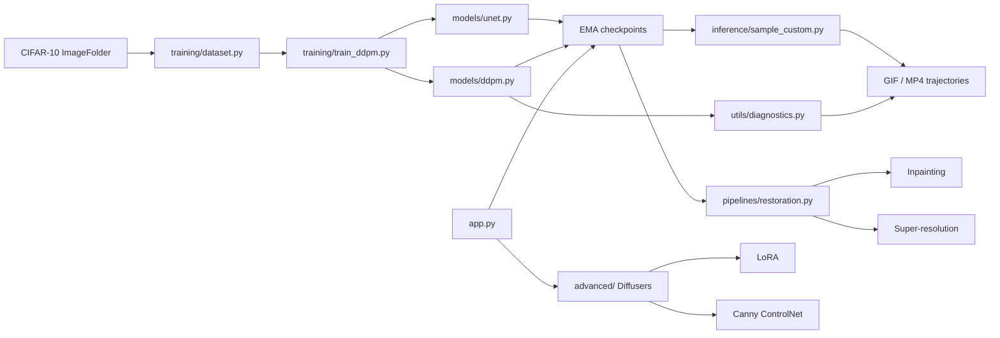

# DiffuSuite

**An end-to-end diffusion sandbox that connects first-principles DDPM math,
restoration tasks, and production-grade Stable Diffusion tooling.**

DiffuSuite was built as a portfolio-grade extension of the ideas in
[denizberkin/inzva-diffusion-notes](https://github.com/denizberkin/inzva-diffusion-notes):
Gaussian forward noising, learned reverse denoising, ELBO intuition, DDPM
training, inference, and conditioning. The repository turns those ideas into a
single modular project with a custom PyTorch core and a Gradio UI.

[](requirements.txt)
[](models/ddpm.py)
[](app.py)
[](notebooks/DiffuSuite_Colab.ipynb)

## What This Project Demonstrates

- A **from-scratch DDPM** with persistent mathematical schedule buffers.
- A **class-conditioned U-Net** with sinusoidal timestep embeddings and learned
  class/null tokens for classifier-free guidance.
- A **CIFAR-10 training pipeline** with AMP, EMA checkpoints, resume support,
  generation previews, and reverse-trajectory export.
- **Restoration pipelines** for inpainting and exploratory super-resolution.
- **Diagnostic media** that visualizes how linear and cosine schedules destroy
  information at different rates.
- Optional **production integrations** using Hugging Face Diffusers: LoRA
  inference, DreamBooth-LoRA training, and Canny ControlNet.
- A **two-tab Gradio dashboard** that separates the mathematical core from the
  production studio.

The custom DDPM/U-Net/restoration sections avoid high-level diffusion wrappers.
Diffusers is isolated in `advanced/` for the production-scale comparison.

## Example Gallery

These bundled examples are reproducible from the audited CIFAR-10 dataset. They
are **not fake trained-model outputs**; they are diagnostics and input/output
examples that can be generated before long GPU training finishes.

### CIFAR-10 Inputs

The local dataset is an extracted CIFAR-10 image-folder tree. One verified input
example from each class:


### Forward Noising Output: Linear vs. Cosine

Same source image, same Gaussian noise tensor, different schedule:


At `T = 1000`, the local diagnostic produced:

| Schedule | `alpha_bar_T` | Forward variance at `T` |
| --- | ---: | ---: |
| Linear | `0.00004036` | `0.99995965` |
| Cosine | approximately `0` | approximately `1` |

### Forward-Process Video

GIF preview:


MP4 version:
[artifacts/examples/forward_linear_vs_cosine.mp4](artifacts/examples/forward_linear_vs_cosine.mp4)

### Restoration Inputs

Inpainting input: source, white-mask region to regenerate, and masked image:


Super-resolution input: original reference and a deliberately degraded
low-resolution observation:


### Post-Training Output Slots

After running the Colab notebook, export and add these trained-model artifacts:

| Artifact | Suggested path |
| --- | --- |
| Cosine generated class grid | `artifacts/generated/cifar10_cosine.png` |
| Linear generated class grid | `artifacts/generated/cifar10_linear.png` |
| Cosine reverse denoising GIF/MP4 | `artifacts/videos/cifar10_cosine_reverse.*` |
| Linear reverse denoising GIF/MP4 | `artifacts/videos/cifar10_linear_reverse.*` |
| Inpainted ship example | `artifacts/restored/inpainted_ship.png` |
| Inpainting trajectory GIF/MP4 | `artifacts/videos/inpainting_ship.*` |
| Super-resolution example | `artifacts/restored/super_res_ship.png` |
| LoRA prompt examples | `artifacts/generated/lora/` |
| ControlNet source-edge-output triplets | `artifacts/generated/controlnet/` |

That boundary matters: the code is complete and validated, but final sample
quality should be reported only after GPU training produces real checkpoints.

## Repository Architecture

```text
diffu_suite/
├── models/
│   ├── ddpm.py                  # Schedule buffers and DDPM equations
│   └── unet.py                  # Conditional residual U-Net with attention
├── training/
│   ├── dataset.py               # Extracted CIFAR-10 ImageFolder loader
│   └── train_ddpm.py            # AMP, EMA, checkpoints, previews, resume
├── inference/
│   ├── sample_custom.py         # Class grids and reverse videos
│   └── restore_custom.py        # Inpainting and super-resolution CLI
├── pipelines/
│   └── restoration.py           # Restoration sampling trajectories
├── advanced/
│   ├── lora_inference.py        # Stable Diffusion LoRA loading
│   ├── train_lora.py            # Official DreamBooth-LoRA trainer launcher
│   └── controlnet.py            # Canny-ControlNet inference
├── utils/
│   ├── diagnostics.py           # Linear-vs-cosine degradation report
│   ├── trajectory_video.py      # GIF and MP4 encoding
│   ├── checkpoints.py           # Shared checkpoint format
│   └── generate_readme_assets.py
├── scripts/
│   └── validate_dataset.py
├── notebooks/
│   └── DiffuSuite_Colab.ipynb   # Direct GPU training notebook
├── tests/
│   └── test_core.py
├── COLAB.md
└── app.py                       # Two-tab Gradio dashboard
```



## Mathematical Core

[`models/ddpm.py`](models/ddpm.py) owns the diffusion process, not the U-Net.
Any compatible epsilon-predicting model can be passed into training or sampling.

Public methods use zero-based PyTorch timestep indices. Code timestep `0`
corresponds to literature timestep `t = 1`.

### Persistent DDPM Buffers

Every important scalar schedule term is stored as a persistent tensor of shape
`[T]`, so the formulas can be inspected directly from a checkpoint.

| Buffer | Formula / meaning |
| --- | --- |
| `betas` | `beta_t` |
| `alphas` | `alpha_t = 1 - beta_t` |
| `alphas_cumprod` | `alpha_bar_t = prod_s alpha_s` |
| `sqrt_alphas_cumprod` | `sqrt(alpha_bar_t)` |
| `sqrt_one_minus_alphas_cumprod` | `sqrt(1 - alpha_bar_t)` |
| `posterior_variance` | `tilde_beta_t` |
| `posterior_std` | `sigma_t` |
| `posterior_mean_coef1/2` | closed-form posterior mean coefficients |

The implementation supports a linear beta schedule and the Nichol-Dhariwal
cosine schedule with offset `s = 0.008`.

### Forward Process

```text
q(x_t | x_0) = N(sqrt(alpha_bar_t) x_0, (1 - alpha_bar_t) I)

x_t = sqrt(alpha_bar_t) x_0 + sqrt(1 - alpha_bar_t) epsilon
epsilon ~ N(0, I)
```

### Training Objective

```text
L_simple(theta) = E[|| epsilon - epsilon_theta(x_t, t, c) ||^2]
```

Classifier-free guidance training randomly replaces labels with the learned null
class token.

### Reverse Sampling

```text
x_(t-1) = 1 / sqrt(alpha_t)
          * (x_t - beta_t / sqrt(1 - alpha_bar_t) * epsilon_theta(x_t, t, c))
          + sigma_t z
```

Guidance uses:

```text
guided_epsilon = (1 + w) * epsilon_conditional - w * epsilon_unconditional
```

## Custom U-Net

[`models/unet.py`](models/unet.py) implements a compact CIFAR-scale U-Net.

| Component | Details |
| --- | --- |
| Input / output | `[B, 3, 32, 32]` normalized to `[-1, 1]` |
| Time conditioning | sinusoidal embedding + MLP |
| Class conditioning | learned class embeddings plus learned null token |
| CFG null class | label `-1` or `class_labels=None` |
| Blocks | GroupNorm + SiLU + conditioned residual convolutions |
| Attention | spatial self-attention at deepest level by default |
| Default parameter count | about `15.7M` |
| Default resolutions | `32 -> 16 -> 8 -> 16 -> 32` |

## Dataset

Expected local layout:

```text
data/cifar10_dataset/
├── train/{0..9}/*.png
└── test/{0..9}/*.png
```

The local folder was audited as:

| Property | Verified value |
| --- | ---: |
| Training images | 50,000 |
| Test images | 10,000 |
| Classes | 10 |
| Training images per class | 5,000 |
| Test images per class | 1,000 |
| Shape | RGB `32x32` |
| Byte-identical duplicate PNGs | 0 |

Run the audit:

```bash
python3 scripts/validate_dataset.py --hashes
```

CIFAR-10 label mapping:

| ID | Class | ID | Class |
| ---: | --- | ---: | --- |
| 0 | airplane | 5 | dog |
| 1 | automobile | 6 | frog |
| 2 | bird | 7 | horse |
| 3 | cat | 8 | ship |
| 4 | deer | 9 | truck |

## Installation

Core project:

```bash
python3 -m venv .venv
source .venv/bin/activate
pip install -r requirements.txt
```

Optional production studio:

```bash
pip install -r requirements-advanced.txt
```

## Colab Training

The fastest path is the notebook:

```text
notebooks/DiffuSuite_Colab.ipynb
```

It assumes your Drive dataset lives at:

```text
/content/drive/MyDrive/diffu_suite/data/cifar10_dataset
```

Open the notebook in Colab, select a GPU runtime, and run cells in order. It
will:

1. Mount Drive.
2. Clone or update this repo.
3. Symlink Drive `data/` and `runs/` into the Colab workspace.
4. Validate CIFAR-10.
5. Run a tiny CUDA smoke test.
6. Train or resume cosine and linear checkpoints.
7. Export class grids, reverse videos, diagnostics, inpainting, and
   super-resolution examples.
8. Launch the Gradio app with a share link.

Manual cosine training command:

```bash
python3 training/train_ddpm.py \
  --data-root data/cifar10_dataset \
  --schedule cosine \
  --output-dir runs/cifar10_cosine \
  --batch-size 64 \
  --epochs 100 \
  --workers 2
```

Manual linear comparison command:

```bash
python3 training/train_ddpm.py \
  --data-root data/cifar10_dataset \
  --schedule linear \
  --output-dir runs/cifar10_linear \
  --batch-size 64 \
  --epochs 100 \
  --workers 2
```

Use `--resume runs/cifar10_cosine/checkpoints/latest.pt` to continue an
interrupted run.

## Inference and Restoration

Generate CIFAR-10 class samples and a reverse denoising video:

```bash
python3 inference/sample_custom.py \
  runs/cifar10_cosine/checkpoints/latest.pt \
  --output artifacts/generated/cifar10_cosine.png \
  --trajectory-stem artifacts/videos/cifar10_cosine_reverse
```

Inpaint an image. White mask pixels are regenerated:

```bash
python3 inference/restore_custom.py \
  runs/cifar10_cosine/checkpoints/latest.pt \
  path/to/source.png \
  --task inpaint \
  --mask path/to/mask.png \
  --class-id 8 \
  --output artifacts/restored/inpainted.png \
  --trajectory-stem artifacts/videos/inpainting
```

Run the exploratory low-frequency-constrained super-resolution baseline:

```bash
python3 inference/restore_custom.py \
  runs/cifar10_cosine/checkpoints/latest.pt \
  path/to/source.png \
  --task super-res \
  --class-id 8 \
  --downsample-factor 4 \
  --output artifacts/restored/super_resolved.png
```

Inpainting is mathematically strict about known pixels: at each reverse step,
known regions are replaced by the matching forward-noised source state. The
tests verify exact final preservation of unmasked pixels.

The super-resolution path is an ILVR-style baseline. It preserves
low-frequency content, but it is not claimed to be a dedicated super-resolution
model.

## Gradio Dashboard

Launch locally:

```bash
python3 app.py
```

Launch from Colab:

```bash
python3 app.py --host 0.0.0.0 --share
```

Tabs:

| Tab | What it does |
| --- | --- |
| Custom Mathematical Core | class generation, inpainting, super-resolution, schedule diagnostics |
| Production-Grade Studio | LoRA text-to-image and Canny ControlNet through Diffusers |

Checkpoint generation always uses the schedule saved inside the checkpoint.
Schedule switching is exposed only in the diagnostics panel, which avoids
sampling a denoiser under a schedule it was not trained on.

## Production Studio

The production modules are optional and lazy. The custom DDPM code imports
without downloading large Stable Diffusion weights.

### LoRA Inference

[`advanced/lora_inference.py`](advanced/lora_inference.py) loads a Stable
Diffusion text-to-image pipeline and attaches local or Hub-hosted LoRA adapters
with `load_lora_weights`.

### DreamBooth-LoRA Training

[`advanced/train_lora.py`](advanced/train_lora.py) launches Hugging Face
Diffusers' maintained DreamBooth-LoRA example instead of freezing a copy of a
fast-moving trainer in this repository.

```bash
git clone --depth 1 https://github.com/huggingface/diffusers third_party/diffusers

python3 advanced/train_lora.py data/lora/my_concept \
  --instance-prompt "a photo of sks ceramic" \
  --output-dir runs/lora/ceramic \
  --dry-run
```

Remove `--dry-run` when the command and concept image folder are correct.

### Canny ControlNet

[`advanced/controlnet.py`](advanced/controlnet.py) extracts Canny edges with
OpenCV, loads `lllyasviel/sd-controlnet-canny`, and generates a new image that
preserves the uploaded layout.

## GPU Guidance

| Workload | Local Apple Silicon / CPU | Colab GPU |
| --- | --- | --- |
| Unit tests and diagnostics | good | optional |
| Tiny training smoke test | good | optional |
| Full CIFAR-10 DDPM training | slow | recommended |
| Stable Diffusion LoRA inference | memory-sensitive | recommended |
| DreamBooth-LoRA training | not recommended | recommended |
| ControlNet inference | memory-sensitive | recommended |

Start Colab training with `--batch-size 64`. Drop to `32` after CUDA
out-of-memory. Try `128` only on a stronger GPU. CUDA training uses float16 AMP
automatically.

## Validation Status

Local verification before publication:

```text
pytest:                   7 passed
dataset audit:            passed
CPU training smoke test:  passed
Apple MPS training step:  passed
EMA checkpoint reload:    passed
Inpainting CLI:           passed
Super-resolution CLI:     passed
GIF and MP4 export:       passed
Gradio HTTP probe:        200 OK
```

Run the regression suite:

```bash
python3 -m pytest -q
```

## Reproduce README Media

```bash
python3 utils/generate_readme_assets.py
```

This recreates:

- `artifacts/examples/cifar10_inputs.png`
- `artifacts/examples/forward_degradation.png`
- `artifacts/examples/forward_linear_vs_cosine.gif`
- `artifacts/examples/forward_linear_vs_cosine.mp4`
- `artifacts/examples/inpainting_input_mask.png`
- `artifacts/examples/super_resolution_input.png`
- `artifacts/examples/source_ship.png`

## References

- [inzva diffusion notes](https://github.com/denizberkin/inzva-diffusion-notes)
- [CIFAR-10 dataset](https://www.cs.toronto.edu/~kriz/cifar.html)
- [Denoising Diffusion Probabilistic Models](https://arxiv.org/abs/2006.11239)
- [Improved Denoising Diffusion Probabilistic Models](https://arxiv.org/abs/2102.09672)
- [Diffusers LoRA loading guide](https://huggingface.co/docs/diffusers/en/using-diffusers/loading_adapters)
- [Diffusers ControlNet guide](https://huggingface.co/docs/diffusers/en/using-diffusers/controlnet)
- [Diffusers DreamBooth examples](https://github.com/huggingface/diffusers/tree/main/examples/dreambooth)
- [Google Colab FAQ](https://research.google.com/colaboratory/faq.html)
