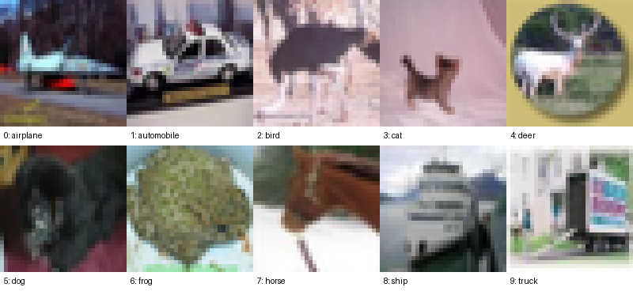
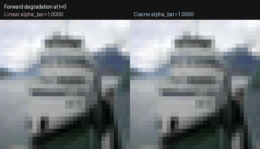
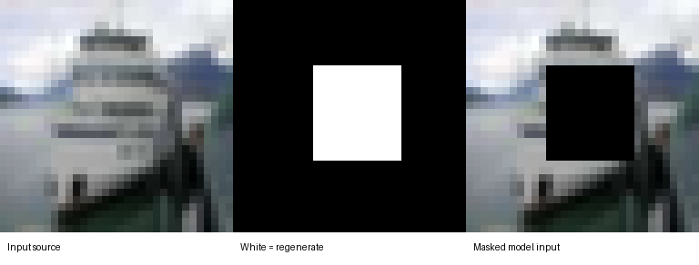
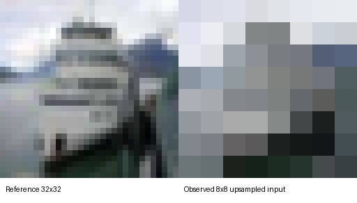

# DiffuSuite

**An end-to-end generative and restoration sandbox for learning diffusion
models from first principles and connecting them to production tooling.**

DiffuSuite begins with the mathematics covered by
[denizberkin/inzva-diffusion-notes](https://github.com/denizberkin/inzva-diffusion-notes):
Gaussian forward noising, learned reverse denoising, ELBO intuition, and the
simple epsilon-prediction objective. It then grows that foundation into one
portfolio project with:

- A from-scratch PyTorch DDPM with persistent schedule buffers.
- A complete class-conditioned U-Net and classifier-free guidance (CFG).
- CIFAR-10 training, EMA checkpoints, generation, inpainting, and exploratory
  super-resolution.
- Forward and reverse trajectory export as GIF and MP4.
- Optional Hugging Face Diffusers hooks for Stable Diffusion LoRA inference,
  DreamBooth-LoRA training, and Canny ControlNet.
- A two-tab Gradio dashboard.

The custom mathematical core does **not** use high-level diffusion wrappers.
Diffusers is isolated inside `advanced/` for the production-scale comparison.

## Project Status

The code paths are implemented and locally smoke-tested. This repository does
not bundle a trained CIFAR-10 checkpoint or large Stable Diffusion weights.
Train the custom linear and cosine checkpoints on a GPU before presenting
generated-image quality or restoration quality as experimental results.

Bundled examples are reproducible **pre-training diagnostics** generated from
the audited local CIFAR-10 data. They intentionally do not pretend that random
weights are a trained generator.

## Verified Dataset

The expected local dataset is an extracted CIFAR-10 image-folder tree:

```text
data/cifar10_dataset/
├── train/
│   ├── 0/*.png
│   ├── ...
│   └── 9/*.png
└── test/
    ├── 0/*.png
    ├── ...
    └── 9/*.png
```

The current local folder passed this audit:

| Property | Verified value |
| --- | ---: |
| Training images | 50,000 |
| Test images | 10,000 |
| Classes | 10 |
| Training images per class | 5,000 |
| Test images per class | 1,000 |
| Shape | RGB `32x32` |
| Byte-identical duplicate PNGs | 0 |

Run the same audit:

```bash
python3 scripts/validate_dataset.py --hashes
```

CIFAR-10 label mapping:

| ID | Class | ID | Class |
| ---: | --- | ---: | --- |
| 0 | airplane | 5 | dog |
| 1 | automobile | 6 | frog |
| 2 | bird | 7 | horse |
| 3 | cat | 8 | ship |
| 4 | deer | 9 | truck |



## Mathematical Core

[`models/ddpm.py`](models/ddpm.py) stores each important literature term as a
persistent PyTorch buffer with shape `[T]`. A code timestep of `0` corresponds
to the literature timestep `t = 1`.

The closed-form forward process is:

```text
q(x_t | x_0) = N(sqrt(alpha_bar_t) x_0, (1 - alpha_bar_t) I)
```

The training objective is:

```text
L_simple = E[|| epsilon - epsilon_theta(x_t, t, c) ||^2]
```

The reverse sampler implements:

```text
x_(t-1) = 1 / sqrt(alpha_t)
          * (x_t - beta_t / sqrt(1 - alpha_bar_t) * epsilon_theta(x_t, t, c))
          + sigma_t z
```

Classifier-free guidance uses the convention:

```text
guided_epsilon = (1 + w) * epsilon_conditional - w * epsilon_unconditional
```

The implementation supports:

- Linear beta schedules.
- Nichol-Dhariwal cosine schedules with `s = 0.008`.
- Closed-form forward sampling at arbitrary timesteps.
- Posterior statistics and ancestral reverse sampling.
- CFG training dropout through a learned null class token.
- Optional full reverse trajectories with shape `[B, T + 1, C, H, W]`.

## Architecture

```text
diffu_suite/
├── models/
│   ├── ddpm.py                  # Schedule buffers and DDPM equations
│   └── unet.py                  # Conditional residual U-Net with attention
├── training/
│   ├── dataset.py               # Extracted CIFAR-10 loader
│   └── train_ddpm.py            # AMP, EMA, checkpoints, previews, resume
├── inference/
│   ├── sample_custom.py         # Class grids and reverse videos
│   └── restore_custom.py        # Inpainting and super-resolution CLI
├── pipelines/
│   └── restoration.py           # Restoration sampling trajectories
├── advanced/
│   ├── lora_inference.py        # Stable Diffusion LoRA loading
│   ├── train_lora.py            # Official DreamBooth-LoRA trainer launcher
│   └── controlnet.py            # Canny-ControlNet inference
├── utils/
│   ├── diagnostics.py           # Linear-versus-cosine degradation report
│   ├── trajectory_video.py      # GIF and MP4 encoding
│   └── generate_readme_assets.py
├── scripts/
│   └── validate_dataset.py
├── tests/
│   └── test_core.py
├── COLAB.md
└── app.py                       # Two-tab Gradio dashboard
```

The default CIFAR-10 U-Net has approximately `15.7M` trainable parameters and
uses feature resolutions `32 -> 16 -> 8`. Attention is limited to the deepest
resolution by default to control memory usage.

## Installation

Core mathematical project:

```bash
python3 -m venv .venv
source .venv/bin/activate
pip install -r requirements.txt
```

Optional production studio:

```bash
pip install -r requirements-advanced.txt
```

## Train the Custom DDPM

Train two controlled experiments with the same U-Net configuration:

```bash
python3 training/train_ddpm.py \
  --schedule cosine \
  --output-dir runs/cifar10_cosine \
  --batch-size 64 \
  --epochs 100

python3 training/train_ddpm.py \
  --schedule linear \
  --output-dir runs/cifar10_linear \
  --batch-size 64 \
  --epochs 100
```

Checkpoints are written to:

```text
runs/cifar10_cosine/checkpoints/latest.pt
runs/cifar10_linear/checkpoints/latest.pt
```

Resume an interrupted run:

```bash
python3 training/train_ddpm.py \
  --resume runs/cifar10_cosine/checkpoints/latest.pt \
  --output-dir runs/cifar10_cosine
```

## Generate and Restore

Generate a class grid and a reverse-process timelapse:

```bash
python3 inference/sample_custom.py \
  runs/cifar10_cosine/checkpoints/latest.pt \
  --output artifacts/generated/cifar10_cosine.png \
  --trajectory-stem artifacts/videos/cifar10_cosine_reverse
```

Inpaint an image. White mask pixels are regenerated:

```bash
python3 inference/restore_custom.py \
  runs/cifar10_cosine/checkpoints/latest.pt \
  path/to/source.png \
  --task inpaint \
  --mask path/to/mask.png \
  --class-id 8 \
  --output artifacts/restored/inpainted.png \
  --trajectory-stem artifacts/videos/inpainting
```

Run the exploratory low-frequency-constrained super-resolution baseline:

```bash
python3 inference/restore_custom.py \
  runs/cifar10_cosine/checkpoints/latest.pt \
  path/to/source.png \
  --task super-res \
  --class-id 8 \
  --downsample-factor 4 \
  --output artifacts/restored/super_resolved.png
```

The super-resolution path is an ILVR-style experiment using the trained image
prior. It is not presented as a replacement for a dedicated super-resolution
diffusion model.

## Diagnostics and Examples

Generate a schedule report for any source image:

```bash
python3 utils/diagnostics.py path/to/source.png \
  --output artifacts/generated/forward_degradation.png
```

Regenerate the seven bundled README assets:

```bash
python3 utils/generate_readme_assets.py
```

### 1. Linear vs. Cosine Information Destruction

The rows below use the same source image and the same Gaussian noise tensor.
Only the schedule changes.


Observed at `T = 1000`:

| Schedule | `alpha_bar_T` | Forward variance at `T` |
| --- | ---: | ---: |
| Linear | `0.00004036` | `0.99995965` |
| Cosine | approximately `0` | approximately `1` |

### 2. Forward-Process Video



MP4 version:
[`artifacts/examples/forward_linear_vs_cosine.mp4`](artifacts/examples/forward_linear_vs_cosine.mp4)

### 3. Inpainting Inputs



At every reverse step, known pixels are replaced with the matching
forward-noised source state. The local tests verify that known pixels are exact
at the final output.

### 4. Super-Resolution Inputs



At every reverse step, low-frequency content is aligned to the observed input.
The local tests verify exact final low-frequency agreement.

### 5. Post-Training Output Catalog

After the Colab training runs, export and retain:

| Artifact | Suggested path |
| --- | --- |
| Cosine class grid | `artifacts/generated/cifar10_cosine.png` |
| Linear class grid | `artifacts/generated/cifar10_linear.png` |
| Reverse denoising GIF and MP4 | `artifacts/videos/cifar10_cosine_reverse.*` |
| Inpainting result | `artifacts/restored/inpainted.png` |
| Inpainting trajectory | `artifacts/videos/inpainting.*` |
| Super-resolution result | `artifacts/restored/super_resolved.png` |
| LoRA text-to-image examples | `artifacts/generated/lora/` |
| ControlNet source, edges, output triplets | `artifacts/generated/controlnet/` |

## Production-Grade Studio

The production integrations are lazy: importing the custom core does not
download models or require Diffusers.

### LoRA Inference

[`advanced/lora_inference.py`](advanced/lora_inference.py) uses
`AutoPipelineForText2Image`, then attaches local or Hub-hosted adapters through
`load_lora_weights`.

### LoRA Training

[`advanced/train_lora.py`](advanced/train_lora.py) launches Hugging Face
Diffusers' maintained DreamBooth-LoRA example. Keeping the trainer upstream
avoids freezing a large, fast-moving training script inside this educational
repository.

Prepare `10-20` licensed images of one concept and inspect the command:

```bash
git clone --depth 1 https://github.com/huggingface/diffusers third_party/diffusers

python3 advanced/train_lora.py data/lora/my_concept \
  --instance-prompt "a photo of sks ceramic" \
  --output-dir runs/lora/ceramic \
  --dry-run
```

Remove `--dry-run` to launch the GPU job.

### Canny ControlNet

[`advanced/controlnet.py`](advanced/controlnet.py) extracts Canny edges with
OpenCV, loads `lllyasviel/sd-controlnet-canny`, and generates a new image while
preserving the uploaded layout.

## Gradio Dashboard

Launch:

```bash
python3 app.py
```

The dashboard contains:

- **Custom Mathematical Core:** conditional generation, inpainting,
  super-resolution, and matched-noise schedule diagnostics.
- **Production-Grade Studio:** LoRA text-to-image and Canny ControlNet.

Checkpoint generation always uses the schedule stored in the checkpoint.
Changing schedules only in the diagnostics panel avoids invalid comparisons
between a trained denoiser and an unseen inference schedule.

## GPU Guidance

The local development machine used for verification is an Apple Silicon system
with `16 GB` unified memory. PyTorch MPS is available and passed a seeded tensor
generation check. It is suitable for tests, dashboard development, and small
experiments.

Use Google Colab for the long jobs. See [`COLAB.md`](COLAB.md).

| Workload | Local Apple MPS | Colab GPU |
| --- | --- | --- |
| Unit tests and diagnostics | Recommended | Optional |
| Tiny one-step training smoke test | Recommended | Optional |
| Full CIFAR-10 DDPM training | Possible but slow | Recommended |
| Stable Diffusion LoRA inference | Memory-sensitive | Recommended |
| DreamBooth-LoRA training | Not recommended | Recommended |
| ControlNet inference | Memory-sensitive | Recommended |

Start custom Colab training with `--batch-size 64`. Increase to `128` if the
assigned GPU permits it, or reduce to `32` after an out-of-memory error. CUDA
training automatically enables float16 AMP. Colab accelerator models and
availability vary by session; free resources are not guaranteed.

## Findings from Local Verification

- The extracted CIFAR-10 folder is complete and balanced.
- The mathematical process exposes `18` persistent schedule buffers.
- Closed-form noising and epsilon-based `x_0` reconstruction agree numerically.
- CFG arithmetic, training loss, EMA checkpoint reloads, and class sampling
  execute successfully.
- Inpainting preserves all known final pixels exactly.
- Exploratory super-resolution preserves the requested final low frequencies.
- GIF and MP4 trajectory export both work locally.
- Gradio constructs the full two-tab dashboard successfully.
- Optional production modules produce clear installation errors when Diffusers
  is absent instead of breaking the custom core.

Run the regression suite:

```bash
python3 -m pytest -q
```

## References

- [inzva diffusion notes](https://github.com/denizberkin/inzva-diffusion-notes)
- [CIFAR-10 dataset](https://www.cs.toronto.edu/~kriz/cifar.html)
- [Denoising Diffusion Probabilistic Models](https://arxiv.org/abs/2006.11239)
- [Improved Denoising Diffusion Probabilistic Models](https://arxiv.org/abs/2102.09672)
- [Diffusers LoRA loading guide](https://huggingface.co/docs/diffusers/en/using-diffusers/loading_adapters)
- [Diffusers ControlNet guide](https://huggingface.co/docs/diffusers/en/using-diffusers/controlnet)
- [Diffusers DreamBooth examples](https://github.com/huggingface/diffusers/tree/main/examples/dreambooth)
- [Google Colab FAQ](https://research.google.com/colaboratory/faq.html)

